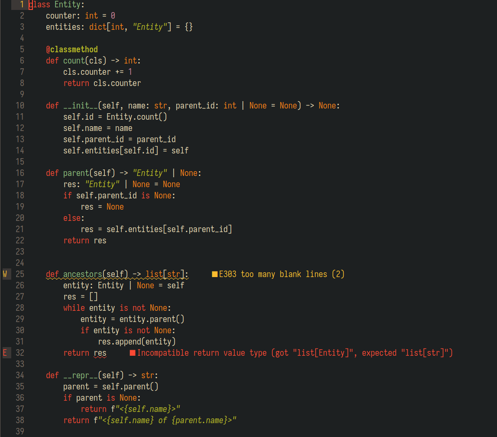

As a seasoned Python Developer I want to be productive and write reliable code. To some point this could be assured by various programming tools,
such as linters, formatters, type checkers, and LSP servers. Most modern IDEs offer out-of-the-box support of these clever utilities, so some developers
don't even think about them.

I've been using Vim and Neovim text editiors as my primary coding tools for years now, and I had to figure out all this LSP stuff myself to make it work.
 I don't mind to do some hands-on tinkering, especially if the topic is of interest for me. Besides, thankfully, Nevim provides some first-class support
 for LSP servers.

So, this is my take on a sane Neovim LSP configuration for a Python developer. 

## Neovim setup basics
A detailed overview of my Neovim config is beyond the scope of this post, but I still need to point out some fundamentals.

So you might already know that Neovim is configured by a bunch of files. Those are not just configuration files, but proper scripts in Lua programming
language (or Vimscript, if you are an old school person). My configuration scripts are organised in a following way:

```bash
nvim/
├── ftplugin
│   └── python.lua 
├── init.lua
└── lua
    ├── config
    │   └── lazy.lua
    └── plugins
        ├── lspconfig.lua
        ├── lualine.lua
        └── ... and all the other plugins I use
```

The `init.lua` script contains some basic config like encoding, indentation rules, highlighting, etc.
The `lua/plugins/` directory contains a separate configuration script for each plugin.
The `ftplugin/` contains language/extension specific configurations (e.g. if you want to have 2-spaced indentation for Perl and 4-spaced for Python).

I use [lazy.nvim](https://lazy.folke.io/) to install and update Neovim plugins, it is very handy and simple to use.

That's mostly simple as that.

## Installing Python LSP with `pipx`
I am aware of [Mason](https://github.com/williamboman/mason.nvim), a Neovim plugin to manage LSPs, linters, etc. Might give it a try some day.

For now my prefered approach is `pipx`, a tool to install Python packages in dedicated virtual environments.
IMHO this is the most convenient way to install Python utilities: linters, formatters, dependency managers, and any Python LSP implementation you prefer.

I personally use [python-lsp-server](https://github.com/python-lsp/python-lsp-server), or `pylsp`, for a long time.
We are going to install it with all optional dependencies. This ensures we have a convenient linting and format checking functionality in our Neovim.

```bash
pipx install python-lsp-server[all]
```

In order to have full advantage of type hinted Python code I would also like to use a type checker, such as [mypy](https://github.com/python/mypy).
There is a `pylsp` plugin that integrates `mypy` into LSP, we won't even need to install `mypy` explicitly.
But here is a deal: we need to install `pylsp-mypy` into the same virtual environment where we have our `pylsp` package installed.
`pipx` has a specific command for that:

```bash
pipx inject python-lsp-server pylsp-mypy
```

You may also want to check out other Python LSP implementations, such as [Pyright](https://github.com/microsoft/pyright).
I figure the approach would be the same.

## lspconfig setup
Now we need to configure Neovim to use the preferred LSP. This can be achieved pretty easily with the help of
[lspconfig](https://github.com/neovim/nvim-lspconfig), a total must-have for your Neovim LSP configuration.
This plugin provides basic configurations for various LSP servers.

I have it set up just as any other plugin in it's own dedicated script:
```lua
return {
    "neovim/nvim-lspconfig",
    tag = "v0.1.8",
    config = function()
        require("lspconfig").pylsp.setup {
            pylsp = {
                pylsp_mypy = {
                    enabled = true,
                },
            }
        }
    end
```
As you can see, there is not so much to configure here. I just have `pylsp-mypy` plugin enabled.
You may find more options [here](https://github.com/python-lsp/python-lsp-server/blob/develop/CONFIGURATION.md),
and here is an [example config](https://github.com/neovim/nvim-lspconfig/blob/master/doc/configs.md#pylsp) from the `lspconfig` repo.
I personally prefer specific style rules to be set individually per project, e.g. in `pyproject.toml`.

With this you should have diagnostic messages from `pylsp` in your Neovim buffer with Python code:


## On `mypy` configuration
When using LSP with integrated `mypy` make sure that it knows where to look for third-party packages. If you are using a virtual environment in your
project, you need to specify its path for `mypy`. It could be achieved via `mypy.ini` configuration file in the root of your project with the following
lines (assuming your virtual environment is located in `.venv/`):

```ini
[mypy]
python_executable=./.venv/bin/python
```

If you want to disable all type messages for a specific project, just add this setting in the same file:

```ini
[mypy]
ignore_errors=true
```

## Adding handy key bindings
The Neovim's LSP functionality is much more than just showing diagnostic messages.
You probably would like to have some LSP actions binded to hotkeys, like showing a method signature or unwrapping a long error message.

The following Lua code will execute each time any LSP attaches the current buffer. keep in mind while all this actions are not `pylsp`-specific, some LSP
implementations might not have them. For example, there is a great formatter [ruff](https://github.com/astral-sh/ruff), which could be run as an LSP server,
but without some crucial methods support (guess it will change some day).

```lua
vim.api.nvim_create_autocmd('LspAttach', {
  group = vim.api.nvim_create_augroup('UserLspConfig', {}),
  callback = function(ev)
    -- Buffer local mappings
    local opts = { buffer = ev.buf }
    
    -- Go to the definition of the symbol (return with CTRL-I)
    vim.keymap.set('n', 'gd', vim.lsp.buf.definition, opts)
    
    -- Show a hover window with symbol's docs
    vim.keymap.set('n', 'K', vim.lsp.buf.hover, opts)

    -- Show symbol usage in the project
    vim.keymap.set('n', 'gr', vim.lsp.buf.references, opts)

    -- Show diagnostics message
    vim.keymap.set('n', '<space>e', vim.diagnostic.open_float, opts)
})
```

More useful LSP methods and their binding examples could be found in the `lspconfig` docs: `:help lspconfig-keybindings`.

## Useful links
- [Blog post by Heiker Curiel](https://vonheikemen.github.io/devlog/tools/neovim-lsp-client-guide/)
