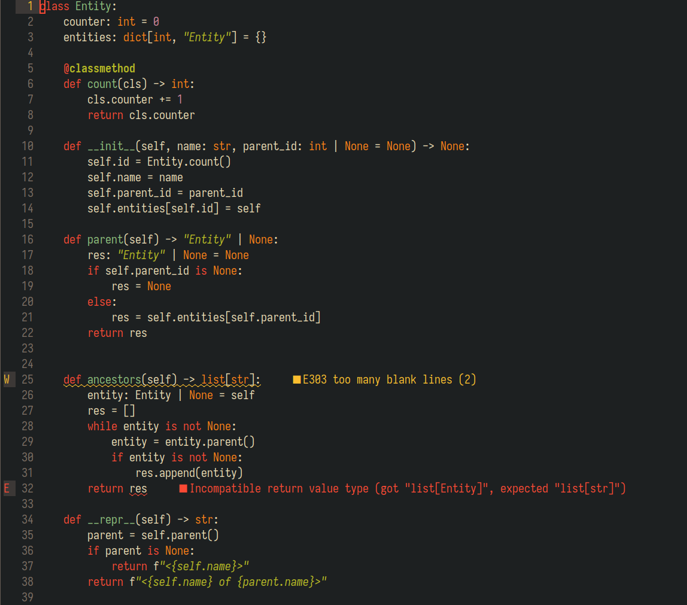
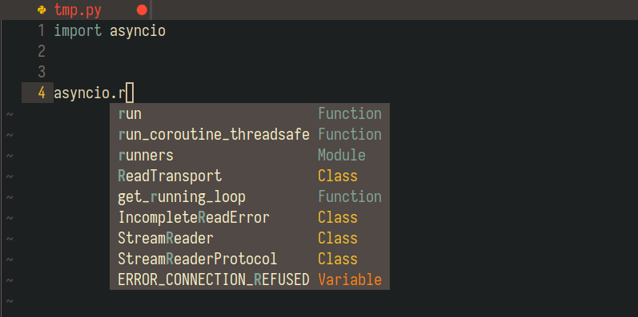

As a dedicated Python Developer I want to be productive and write reliable code. To some point this could be assured by
various programming tools, such as linters, formatters, type checkers, and LSP servers. Most modern IDEs offer
out-of-the-box support of these clever utilities, so some developers don't even think about them.

I've been using Vim and Neovim text editiors as my primary coding tools for years now, and I had to figure out all this
LSP stuff myself to make it work. I don't mind to do some hands-on tinkering, especially if the topic is of interest
for me. Besides, thankfully, Nevim provides some first-class support for LSP servers.

So, this is my take on a sane Neovim LSP configuration for a Python developer. 

## My language server choice

There are plenty of Python LSP implementations, all of them have some cool and sometimes unique features. Probably, the
most popular among them is [Pyright](https://github.com/microsoft/pyright), which combines type checking with LSP
functionality. It is an open source core of the Microsoft's Pylance. Pyright might be a good place to start.

There is also a bunch of language servers based on an amazing [Jedi](https://jedi.readthedocs.io/en/latest/) Python
refactoring package. It powers some essential LSP functions like symbols search, renaming, showing references and
definitions, and detecting virtual environments. The languages servers that use Jedi are listed on its wiki:

- [jedi-language-server](https://github.com/pappasam/jedi-language-server)
- [python-language-server](https://github.com/palantir/python-language-server) (currently unmaintained)
- [python-lsp-server](https://github.com/python-lsp/python-lsp-server) (fork from python-language-server)
- [anakin-language-server](https://github.com/muffinmad/anakin-language-server)

I personally prefer `python-lsp-server` (or `pylsp`) for the following reasons:

1. It is written in Python, so I can easily understand its source and patch it.
2. It has a plugin mechanism which allows me to choose from a bunch of external tools
    (such as [mypy](https://github.com/python/mypy)) and easily write my own plugins.

Additionally, I would really like to use such fast and flexible diagnostic tool as
[Ruff](https://docs.astral.sh/ruff/). Ruff has its own built-in language server, and there is some huge work being done
to implement static type checking functionality
(see [red-knot](https://github.com/astral-sh/ruff/issues?q=label%3Ared-knot%20) label in the issue tracker).
Unfortunately, Ruff doesn't support some LSP tricks like definitions, references and autocompletion. It also doesn't 
have any plug system.

The good news is that we can use both `pylsp` and `ruff` at the same time!

## Neovim setup basics
A detailed overview of my Neovim config is beyond the scope of this post, but I still need to point out some
fundamentals.

So you might already know that Neovim is configured by a bunch of files. Those are not just configuration files, but
proper scripts in Lua programming language (or Vimscript, if you are an old school person). My configuration scripts
are organised in a following way:

```bash
nvim/
├── ftplugin
│   └── python.lua 
├── init.lua
└── lua
    ├── config
    │   └── lazy.lua
    └── plugins
        ├── lspconfig.lua
        ├── lualine.lua
        └── ... and all the other plugins I use
```

The `init.lua` script contains some basic config like encoding, indentation rules, highlighting, etc.
The `lua/plugins/` directory contains a separate configuration script for each plugin.
The `ftplugin/` contains language/extension specific configurations (e.g. if you want to have 2-spaced indentation for
Perl and 4-spaced for Python).

I use [lazy.nvim](https://lazy.folke.io/) to install and update Neovim plugins, it is very handy and simple to use.

That's mostly simple as that.

## Installing Python LSP with `pipx`
I am aware of [Mason](https://github.com/williamboman/mason.nvim), a Neovim plugin to manage LSPs, linters, etc. Might
give it a try some day.

For now my preferred approach is `pipx`, a tool to install Python packages in dedicated virtual environments.
IMHO this is the most convenient way to install Python utilities: linters, formatters, dependency managers, and any
Python LSP implementation you prefer.

We are going to install `python-lsp-server` with `pylsp-mypy` optional plugin in the same virtual environment so that
`pylsp` will find the plugin entry point:

```bash
pipx install python-lsp-server[all]
pipx inject python-lsp-server pylsp-mypy
```

We'll also need `ruff`, but it must be installed in a separate environment as it will work independently from `pylsp`:
```bash
pipx install ruff
```

## `lspconfig` setup
Now we need to configure Neovim to use the preferred LSP. This can be achieved pretty easily with the help of
[lspconfig](https://github.com/neovim/nvim-lspconfig), a total must-have for your Neovim LSP configuration.
This plugin provides basic configurations for various LSP servers.

I have it set up just as any other plugin in it's own dedicated script:
```lua
return {
    "neovim/nvim-lspconfig",
    config = function()
        local lspconfig = require("lspconfig")

        -- Enable Ruff server
        lspconfig.ruff.setup{}

        -- Enable pylsp
        lspconfig.pylsp.setup {
            cmd = {"pylsp", "-vv", "--log-file", "/tmp/pylsp.log"},
            settings = {
                pylsp = {
                    plugins = {
                        -- Disable built-in linters and formatters in favor of Ruff
                        pyflakes = { enabled = false },
                        mccabe = { enabled = false },
                        yapf = { enabled = false },
                        autopep8 = { enabled = false },

                        -- Enable mypy plugin for type checking 
                        pylsp_mypy = {enabled = true},
                    }
                }
            }
        }
    end
}
```

 With this you should have diagnostic messages from `pylsp` in your Neovim buffer with Python code:



You may find more configuration options
[here](https://github.com/python-lsp/python-lsp-server/blob/develop/CONFIGURATION.md), and here is an
[example config](https://github.com/neovim/nvim-lspconfig/blob/master/doc/configs.md#pylsp) from the `lspconfig` repo.

## On `mypy` configuration
When using LSP with integrated `mypy` make sure that it knows where to look for third-party packages. If you are using
a virtual environment in your project, you need to specify its path for `mypy`. It could be achieved via `mypy.ini`
configuration file in the root of your project with the following lines (assuming your virtual environment is located
in `.venv/`):

```ini
[mypy]
python_executable=./.venv/bin/python
```

If you want to disable all type messages for a specific project, just add this setting in the same file:

```ini
[mypy]
ignore_errors=true
```

## Adding handy key bindings
The Neovim's LSP functionality is much more than just showing diagnostic messages.
You probably would like to have some LSP actions binded to hotkeys, like showing a method signature or unwrapping a
long error message.

The following Lua code will execute each time any LSP attaches the current buffer. Keep in mind while all these actions
are not `pylsp`-specific, some LSP implementations might not have them.

```lua
vim.api.nvim_create_autocmd('LspAttach', {
  group = vim.api.nvim_create_augroup('UserLspConfig', {}),
  callback = function(ev)
    -- Buffer local mappings
    local opts = { buffer = ev.buf }
    
    -- Go to the definition of the symbol (return with CTRL-I)
    vim.keymap.set('n', 'gd', vim.lsp.buf.definition, opts)
    
    -- Show a hover window with symbol's docs
    vim.keymap.set('n', 'K', vim.lsp.buf.hover, opts)

    -- Show symbol usage in the project
    vim.keymap.set('n', 'gr', vim.lsp.buf.references, opts)

    -- Show diagnostics message
    vim.keymap.set('n', '<space>e', vim.diagnostic.open_float, opts)
})
```

More useful LSP methods and their binding examples could be found in the `lspconfig` docs:
`:help lspconfig-keybindings`.

## Advanced completion
By default Neovim provides only literals from open buffers for autocompletion. This is not very handy and will
definitely make our lives harder compared to our IDE wielding colleagues. It can be extended though with the help of
LSP.

First of all, we need [nvim-cmp](https://github.com/hrsh7th/nvim-cmp) Neovim plugin enhancing built-in completion
capabilities. Here is my `nvim-cmp` configuration:
```lua
return {
    "hrsh7th/nvim-cmp",
    dependencies = {
        "hrsh7th/cmp-nvim-lsp",
        "hrsh7th/cmp-buffer",
        "hrsh7th/cmp-path",
    },
    config = function()
        local cmp = require("cmp")
        
        cmp.setup({
            -- I don't like when completion options appear without a direct command
            completion = {
                autocomplete = false
            },

            -- Use built-in Neovim snippet engine
            snippet = {
                expand = function(args)
                    vim.snippet.expand(args.body)
                end,
            },

            -- Bindings
            mapping = cmp.mapping.preset.insert({
                ['<C-n>'] = cmp.mapping.complete(),
                ['<Tab>'] = cmp.mapping.select_next_item(),
                ['<S-Tab>'] = cmp.mapping.select_prev_item(),
                ['<CR>'] = cmp.mapping.confirm({ select = true }),
            }),

            -- Use completion options from language servers, buffers and path
            sources = cmp.config.sources({
                { name = 'nvim_lsp' }, 
                { name = 'buffer' },
                { name = 'path' },
            })
        })
    end,
}
```

Now we need `pylsp` to provide Neovim with new completion options. To do that we enable some built-in plugins and inform
`pylsp` about Neovim's completion capabilities. The following code is an extended version of
[previously shown](#lspconfig-setup) `lspconfig` setup (I've highlighted changes for you):

```lua {hl_lines=[5, 12, "16-20"]}
return {
    "neovim/nvim-lspconfig",
    config = function()
        local lspconfig = require("lspconfig")
        local capabilities = require("cmp_nvim_lsp").default_capabilities()
        
        -- Enable Ruff server
        lspconfig.ruff.setup{}

        -- Enable pylsp
        lspconfig.pylsp.setup {
            capabilities = capabilities,
            settings = {
                pylsp = {
                    plugins = {
                        jedi_completion = { enabled = true },
                        jedi_hover = { enabled = true },
                        jedi_references = { enabled = true },
                        jedi_signature_help = { enabled = true },
                        jedi_symbols = { enabled = true, all_scopes = true },

                        -- Disable linters and formatters
                        pyflakes = { enabled = false },
                        mccabe = { enabled = false },
                        yapf = { enabled = false },
                        autopep8 = { enabled = false },

                        -- For type checking 
                        pylsp_mypy = {enabled = true},
                    }
                }
            }
        }
    end
}
```

And now we can get not only literals, but also objects attributes in our completion options:



## To be continued?
I still occasionally update this article weeks after it was originally published, and many months after I started to
dig into language servers and Neovim LSP support, and I still find some new and exciting ways to adjust my setup.
Well, I like doing that! I will definitely continue this project, and for sure there will be more interesting updates
to this post.

## Useful links
- [Blog post by Heiker Curiel](https://vonheikemen.github.io/devlog/tools/neovim-lsp-client-guide/)
